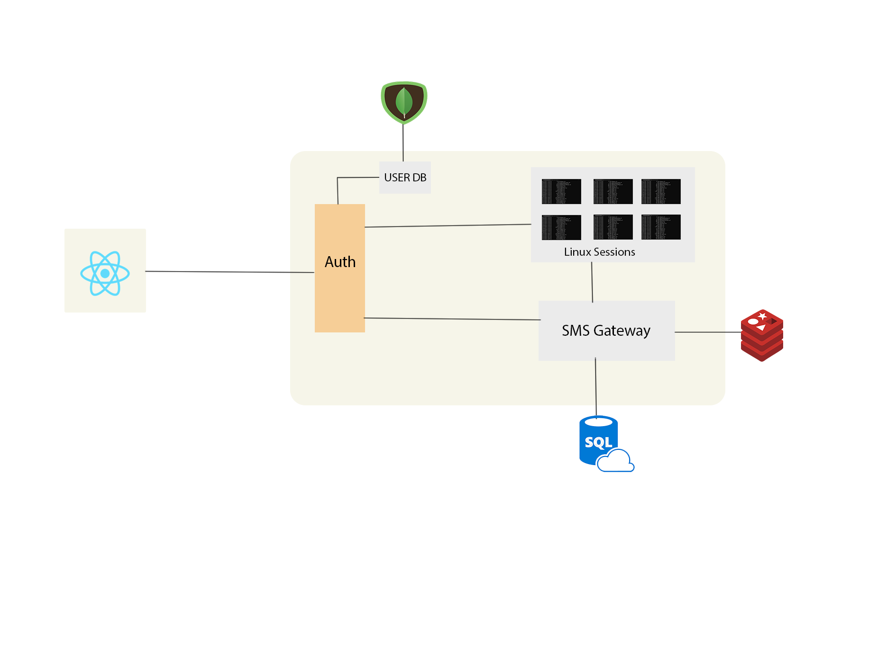
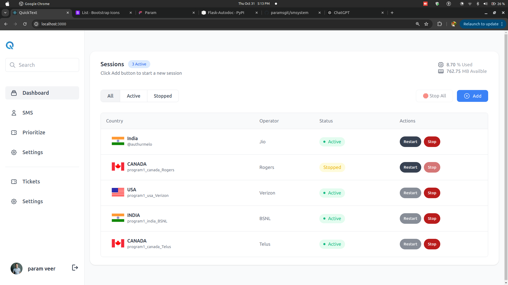
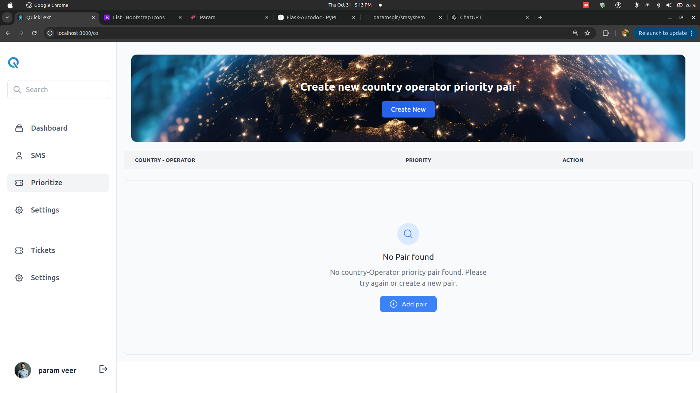
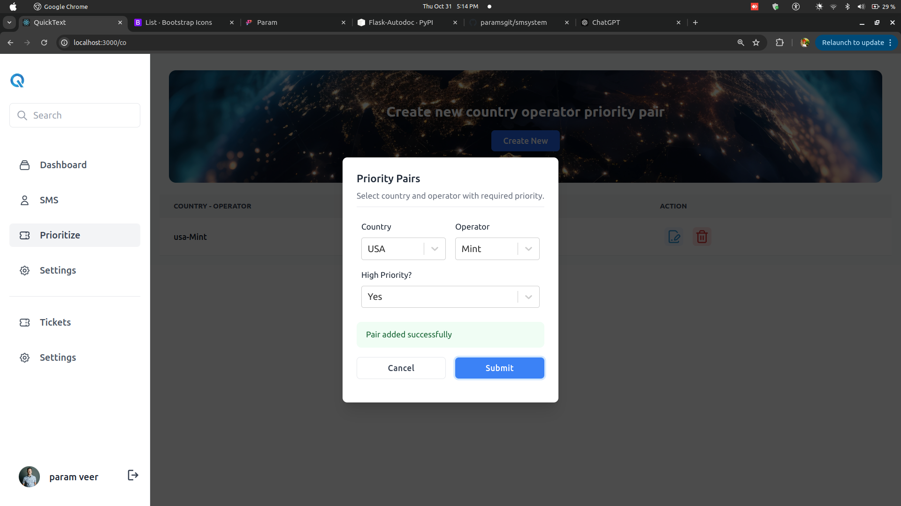
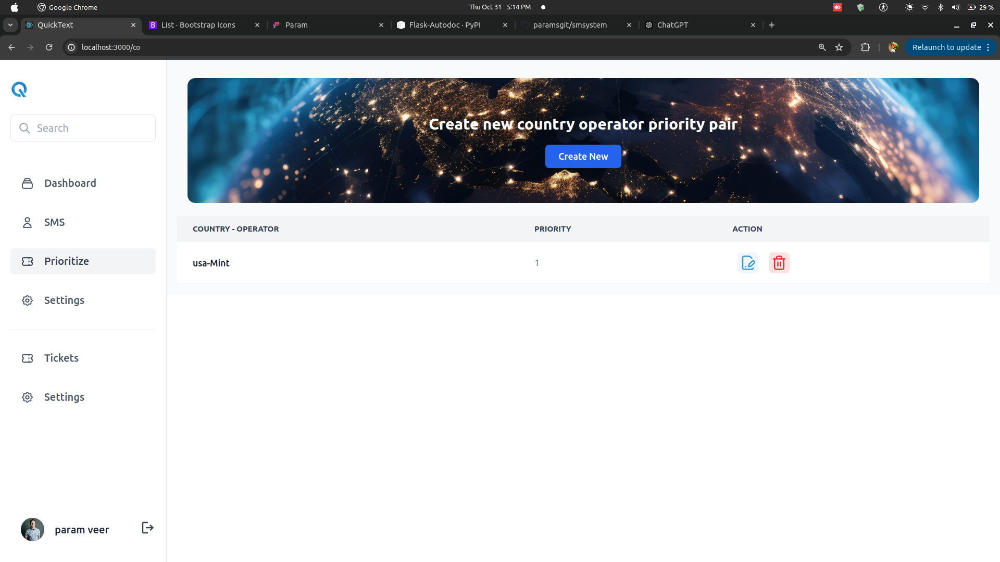
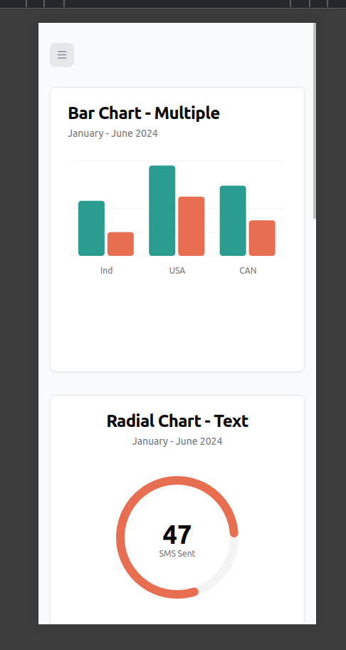

# System Management Dashboard 

The frontend dashboard for managing system resources, users, and tasks. Built with TypeScript and React, this interface allows users to view, create, update, and delete system data seamlessly.

## Architecture



- Dashboard



- Metrics


- Country - Operator Pairs



- Priority Update



- Priority Table with Actions



- Send Sms


- Responsive Web-app




# Backend Documentation

This is the backend API for the System Management System (SMS). The API is built using Flask and serves as the backbone for managing system-related tasks and user data.

## Table of Contents
- [Installation](#installation)
- [Configuration](#configuration)
- [Endpoints](#endpoints)
- [Error Handling](#error-handling)
- [Testing](#testing)

---

## Installation

1. **Clone the Repository**
   ```bash
   git clone https://github.com/paramsgit/smsystem.git
   cd smsystem/backend 
   ```

2. **Set Up a Virtual Environment**
```
python3 -m venv venv
source venv/bin/activate
```

3. Install Dependencies
```
pip install -r requirements.txt
```
# Configuration 

Create a .env file in the backend directory to define environment variables, such as:
```
FLASK_APP=app.py
FLASK_ENV=development
DATABASE_URI=your_database_uri_here
SECRET_KEY=your_secret_key
```

# Running the App

- To run the server locally, use:

```
flask run
 ```
 or
```
python3 app.py
 ```

# Endpoints

## User Management 

- GET /api/users - Retrieve all users
- POST /api/users - Create a new user
- GET /api/users/<user_id> - Get a specific user by ID
- PUT /api/users/<user_id> - Update a user
- DELETE /api/users/<user_id> - Delete a user

## Authentication
- POST /api/auth/login - Log in a user
- POST /api/auth/register - Register a new user

## Session
- GET /session - Retrieve all sessions
- POST /session/start - Create a new session
- POST /session/stop - Stop a session

## SMS
- GET /api/metrics - Retrieve SMS Metrics
- POST /api/send_sms - Send a new SMS
- POST /api/operators/pairs - Add a new Country-operator pair
- Get /api/operators/pairs - Retrieve all Country-operator pairs
- PUT /api/operators/pairs/:ID - Update Country-operator pair's priority
- DELETE /api/operators/pairs/:ID - Update Country-operator pair's priority

# Error Handling
The API uses standard HTTP status codes to indicate success and error responses:

- 200 OK - Successful requests
- 400 Bad Request - Invalid input
- 401 Unauthorized - Authentication failed
- 404 Not Found - Resource not found

# Testing

Use this file to check all apis : 
[Postman Collection](/thunder-collection_smssystem.json)


## License
MIT License
```
This file includes setup, configuration, and sample API endpoint descriptions to help users get started with the backend API.
```
